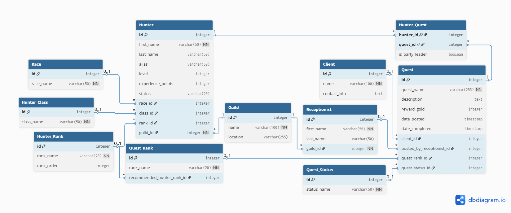
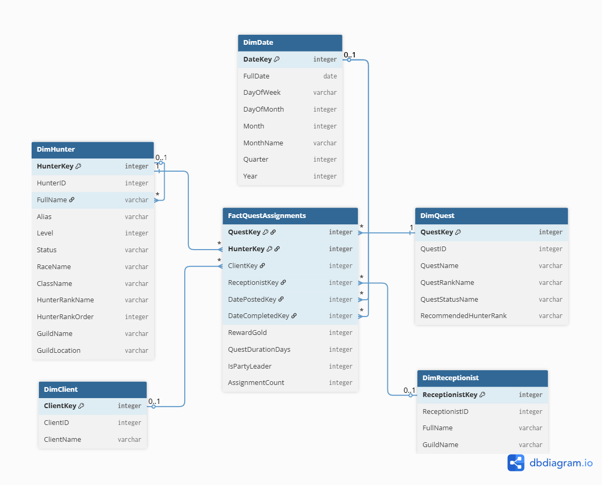

# ETL Project: Fantasy Guild Hunter Management

This project demonstrates a complete ETL (Extract, Transform, Load) process using Node.js and SQLite. The case study involves a fantasy world where a Hunter's Guild manages quests, hunters, clients, and assignments. Data is extracted from a transactional database (OLTP), transformed into a structure suitable for analysis, and loaded into a dimensional data warehouse (DWH).

## Features

* **OLTP Database**: A normalized relational database (`guild_oltp.db`) designed for day-to-day guild operations.
* **Dimensional Model (DWH)**: A star schema data warehouse (`guild_dwh.db`) optimized for analytical queries and business intelligence.
* **Node.js ETL Script**: A robust script (`etl.js`) that automates the entire process of moving and transforming data from the OLTP source to the DWH destination.

## Technology Stack

* **Backend**: Node.js
* **Database**: SQLite 3
* **Core Dependency**: `sqlite3` (Node.js driver)

## Database Schema

### 1. OLTP (Online Transaction Processing) Schema

This schema is designed for transactional efficiency, capturing the daily activities of the guild. It is highly normalized to reduce data redundancy.



### 2. Dimensional Model (Star Schema)

This schema is designed for analytical efficiency, allowing for fast queries on large volumes of data. It consists of a central `FactQuestAssignments` table surrounded by descriptive dimension tables.



## Getting Started

Follow these steps to set up and run the project on your local machine.

### Prerequisites

* **Node.js**: Make sure you have Node.js installed. You can download it from [nodejs.org](https://nodejs.org/).
* **DB Browser for SQLite**: This tool is highly recommended for viewing and interacting with the SQLite database files. You can download it from [sqlitebrowser.org](https://sqlitebrowser.org/).

### Setup & Installation

1.  **Clone the Repository**
    ```sh
    git clone [https://github.com/NazmiHakim/ETL-Project-Fantasy-Guild.git](https://github.com/NazmiHakim/ETL-Project-Fantasy-Guild.git)
    cd ETL-Project-Fantasy-Guild
    ```

2.  **Install Dependencies**
    Open your terminal in the project directory and run the following command to install the necessary `sqlite3` package:
    ```sh
    npm install
    ```
    This command reads the `package.json` file and installs the required dependencies into the `node_modules` folder.

3.  **Prepare the Databases (Important!)**

    This project requires two SQLite database files: `guild_oltp.db` (the source) and `guild_dwh.db` (the destination).

    * **Create the Database Schemas**:
        * Open **DB Browser for SQLite**.
        * Create the tables for `guild_oltp.db` using the [OLTP schema query](<link-to-your-oltp-schema.sql>).
        * Create the tables for `guild_dwh.db` using the [DWH schema query](<link-to-your-dwh-schema.sql>).
    * **Populate the OLTP Database**:
        * Open the `guild_oltp.db` file with DB Browser.
        * Run the [data seeding query](<link-to-your-seed-data.sql>) to add sample data. **Do not add any data to `guild_dwh.db`**, as the script will do this automatically.

## Running the ETL Process

Once the setup is complete, you can run the ETL script.

Execute the following command in your terminal from the root directory of the project:

```sh
node etl.js
